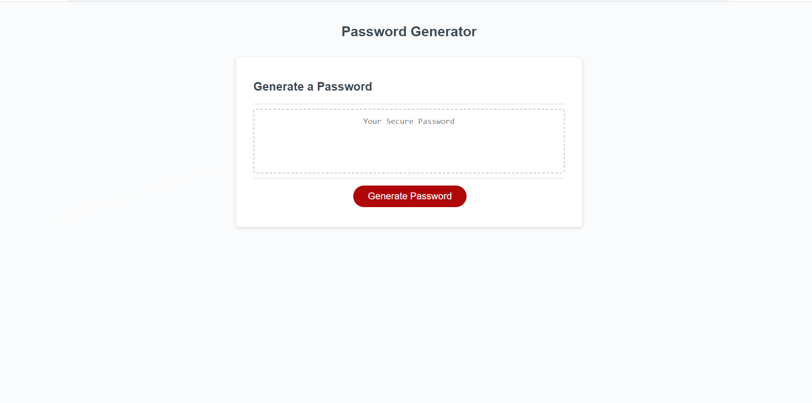

# Password Generator



## Description

This project is meant to create a secure password for the user. The user goes through the promps and then a random secure password is generated. The user can choose between capital letters, lowercase letters and special charaters.


## Installation

1. Clone the repo
   ```sh
   git clone https://github.com/hoeferg/password-generator
   ```
2. Install NPM packages
   ```sh
   npm install
   ```
3. Start the application
   ```sh
   npm start


## License

No license

---

## Contact
Gayle Hoefer - [LinkedIn](https://www.linkedin.com/in/gayle-hoefer-61a2a3124/) - [Github](https://github.com/hoeferg)


